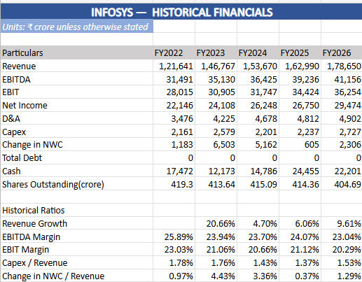
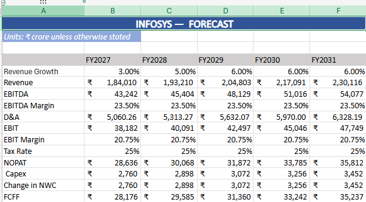
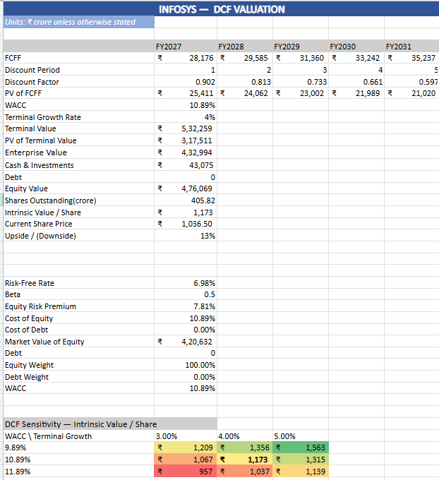
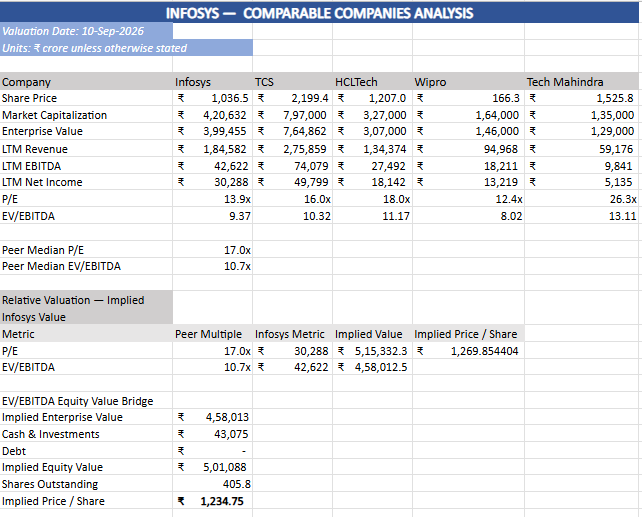

# Infosys Stock Valuation Model

An Excel-based Discounted Cash Flow (DCF) and Comparable Company Analysis model for valuing Infosys Limited.

The model combines historical financial analysis, operating forecasts, FCFF-based DCF valuation, WACC calculation, sensitivity analysis, and relative valuation using peer-company multiples.

**Valuation Date:** 10-Sep-2026
**Company:** Infosys Limited
**Currency:** ₹ crore unless otherwise stated

---

## Valuation Snapshot

| Valuation Method             | Implied Value / Share | Upside vs. Current Price |
| ---------------------------- | --------------------: | -----------------------: |
| Current Share Price          |             ₹1,036.50 |                        — |
| DCF Valuation                |             ₹1,173.10 |                  +13.18% |
| P/E Relative Valuation       |             ₹1,269.85 |                  +22.51% |
| EV/EBITDA Relative Valuation |             ₹1,234.75 |                  +19.13% |

### Base-Case View

The base-case DCF produces an intrinsic value of approximately **₹1,173 per share**, implying approximately **13.2% upside** to the valuation-date share price of ₹1,036.50.

Infosys also trades at a discount to the selected peer group on both P/E and EV/EBITDA, providing a supportive relative-valuation signal.

> Note: These outputs are model-based estimates and are sensitive to the assumptions described below.

---

## Project Overview

This project was built to develop and demonstrate practical skills in:

* Financial statement analysis
* Financial forecasting
* Discounted Cash Flow valuation
* WACC and CAPM
* Free Cash Flow to Firm (FCFF)
* Comparable Company Analysis
* Sensitivity analysis
* Excel-based financial modeling

The model uses **FY2022–FY2026 historical financials** and forecasts **FY2027–FY2031**.

---

## DCF Methodology

The DCF valuation follows a standard FCFF-based approach:

1. Forecast revenue and operating performance for FY2027–FY2031.
2. Calculate EBITDA, D&A, EBIT and NOPAT.
3. Estimate capital expenditure and changes in net working capital.
4. Derive Free Cash Flow to Firm (FCFF).
5. Discount projected FCFF using WACC.
6. Calculate terminal value using the Gordon Growth Method.
7. Bridge Enterprise Value to Equity Value using cash and debt.
8. Divide Equity Value by shares outstanding to derive intrinsic value per share.

### DCF Formula

**FCFF = NOPAT + D&A − Capex − Change in NWC**

**Terminal Value = FCFFₙ × (1 + g) / (WACC − g)**

---

## ⚙️ Key DCF Assumptions

| Assumption              | Base Case |
| ----------------------- | --------: |
| WACC                    |    10.89% |
| Terminal Growth         |     4.00% |
| FY2027 Revenue Growth   |     3.00% |
| FY2031 Revenue Growth   |     6.00% |
| EBITDA Margin           |    23.50% |
| Tax Rate                |    25.00% |
| Capex / Revenue         |     1.50% |
| Change in NWC / Revenue |     1.50% |

The FY2027 revenue-growth assumption uses the upper end of Infosys' revised guidance range. FY2028–FY2031 represent analyst assumptions used for the model.

The terminal growth rate is a normalized long-term assumption and is not company guidance.

---

## DCF Sensitivity

The DCF valuation is particularly sensitive to changes in WACC and terminal growth.

| Scenario     |   WACC | Terminal Growth | Implied Value / Share | Upside / (Downside) |
| ------------ | -----: | --------------: | --------------------: | ------------------: |
| Conservative | 11.89% |           3.00% |                  ₹957 |              -7.62% |
| Base Case    | 10.89% |           4.00% |                ₹1,173 |             +13.18% |
| Optimistic   |  9.89% |           5.00% |                ₹1,563 |             +50.79% |

Across the tested sensitivity range, the implied valuation spans approximately **₹957–₹1,563 per share**.

This highlights the importance of WACC and terminal-growth assumptions in long-duration DCF valuations.

---

## Comparable Company Analysis

The relative valuation uses the following listed Indian IT peers:

* Tata Consultancy Services (TCS)
* HCLTech
* Wipro
* Tech Mahindra

The analysis compares Infosys and its peers using:

* P/E
* EV/EBITDA

| Metric    | Infosys | Peer Median | Discount |
| --------- | ------: | ----------: | -------: |
| P/E       |   13.9x |       17.0x |  -18.38% |
| EV/EBITDA |    9.4x |       10.7x |  -12.79% |

The peer median excludes Infosys itself.

The implied values are calculated by applying peer multiples to Infosys' LTM financial metrics.

---

## Model Visualizations

### Historical Financials



### Forecast Financials



### DCF Valuation



### Comparable Company Analysis



---

## Repository Structure

```text
stock-valuation-model/
│
├── model/
│   └── DCF_Model_v1.xlsx
│
├── output/
│   └── valuation_summary.pdf
│
├── screenshots/
│   ├── inputs.png
│   ├── historicals.png
│   ├── forecast.png
│   ├── dcf.png
│   └── comps.png
│
└── README.md
```

---

## Files

* [DCF Model](model/DCF_Model_v1.xlsx) — Complete Excel valuation model
* [Valuation Summary](output/valuation_summary.pdf) — One-page valuation summary

---

## Model Structure

The Excel workbook contains dedicated sections for:

* Inputs and assumptions
* Historical financials
* Forecast financials
* WACC calculation
* DCF valuation
* DCF sensitivity analysis
* Comparable company analysis
* Valuation summary
* Sources

---

## Sources & Methodology

The model uses publicly available company financial information and market data.

Historical financials, valuation inputs, peer multiples and other assumptions were compiled and incorporated into the Excel model.

The valuation combines both **intrinsic valuation (DCF)** and **relative valuation (comparable companies)** to provide multiple perspectives on Infosys' implied value.

---

## Key Takeaways

* Base-case DCF value: **₹1,173 per share**
* Current share price used: **₹1,036.50**
* Implied DCF upside: **13.18%**
* P/E-based implied value: **₹1,269.85**
* EV/EBITDA-based implied value: **₹1,234.75**
* DCF sensitivity range: approximately **₹957–₹1,563 per share**

The model indicates moderate upside under the base-case assumptions, while also demonstrating the sensitivity of DCF valuations to WACC and terminal-growth assumptions.

---

## Limitations

This project is intended for educational and portfolio purposes.

The valuation is dependent on assumptions regarding revenue growth, margins, capital expenditure, working capital, WACC, terminal growth and peer-company multiples.

The outputs should not be interpreted as investment advice or a recommendation to buy or sell securities.

---

## Project Purpose

This project demonstrates the application of financial modeling and valuation concepts in a practical Excel-based equity research framework.

It was created as a portfolio project to demonstrate understanding of **DCF valuation, financial forecasting, WACC, FCFF, comparable-company analysis and Excel modeling**.
